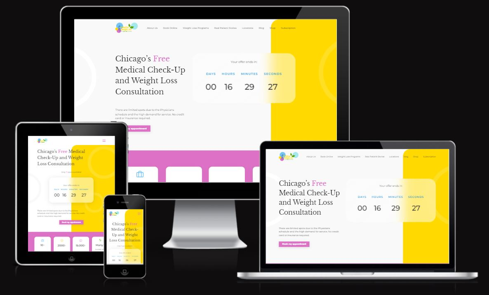

# Alpha Efficiency Test Project

> This is a responsive landing page made with HTML, CSS, and Javascript. The project includes a responsive burger menu with listed items in the navigation, a drop-down menu for Frequently Asked Questions (FAQs), as well as a countdown feature.

## Live Link

[Live project](https://alpha-efficiency-test.netlify.app/)

## Mockup:

It is responsive across multiple devices.

## Built With

- HTML
- CSS
- Javascript

## Author

👤 **Abhigyan Mahanta**

- Portfolio: [Portfolio](https://abhigyanmahanta.netlify.app)
- Github: [@githubhandle](https://github.com/Abhigyan001)
- Linkedin: [Linkedin Profile](https://www.linkedin.com/in/abhigyanmahanta/)

## Show your support

Give a ⭐️ if you like this project!

